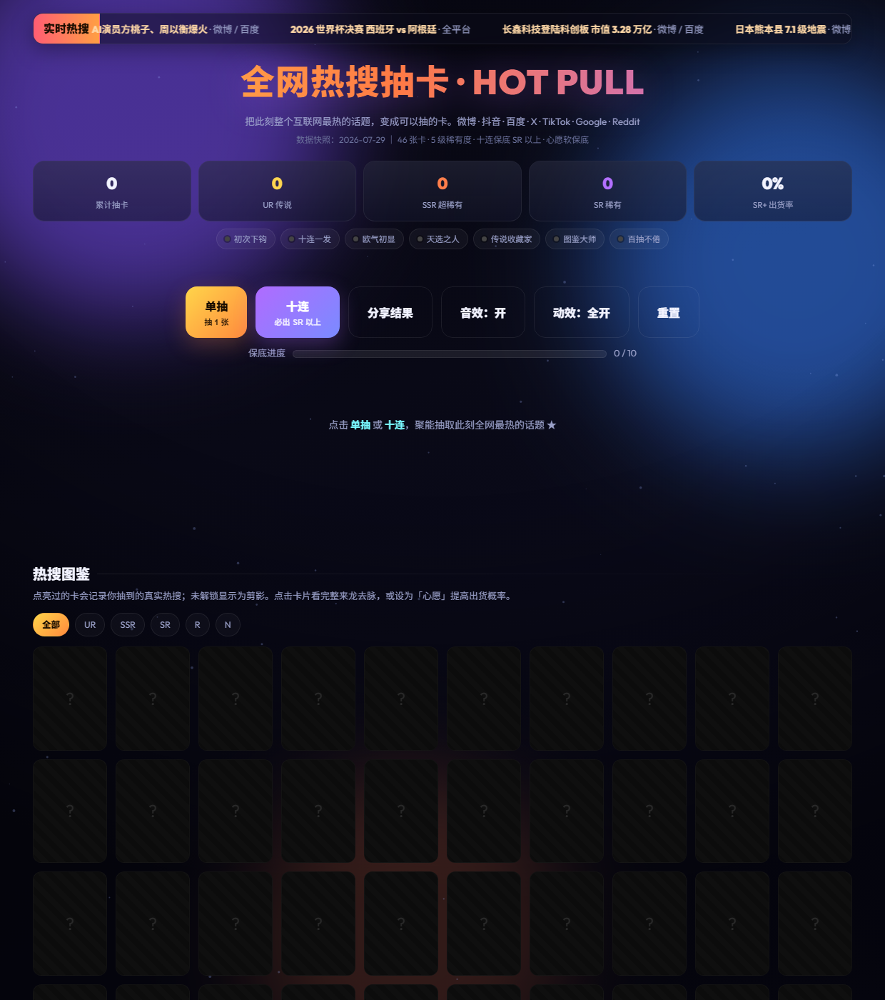

# 全网热搜抽卡 · HOT PULL

> 把此刻整个互联网最热的话题，变成可以抽的卡。

**在线体验：** https://luisdingww-bit.github.io/hot-pull/

## 预览



## 这是什么

一个单页 HTML 的「抽卡」小游戏。卡池来自 2026-07-29 当天全网真实热搜/趋势：微博、抖音、百度、X（Twitter）、TikTok、Google Trends、Reddit 等。每张卡对应一个真实话题，点击「单抽」或「十连」，你就能把当前最热的搜索「抽」出来。

## 核心玩法

- **单抽 / 十连**：抽 1 张或 10 张；十连保底必出 SR 以上。
- **5 级稀有度**：UR（传说）、SSR（超稀有）、SR（稀有）、R（普通）、N。
- **稀有度特效**：UR / SSR 出货时带粒子爆发与专属音效（Web Audio 合成）。
- **图鉴系统**：抽到过的卡会点亮，未解锁显示为剪影；可按稀有度筛选。
- **详情弹窗**：点击卡片查看该热搜的来龙去脉、来源平台与领域。
- **统计面板**：累计抽数、出货数、SR+ 出货率、保底进度条。
- **热搜滚动条**：顶部实时滚动当前高热话题。

数据与进度保存在浏览器 `localStorage` 中，刷新不丢失。

## 数据来源

数据快照：**2026-07-29**

- 微博热搜（AI演员、塔斯汀缩水、广东医生请假、暑期档票房等）
- 百度热搜（世界杯、长鑫科技、日本地震、DeepSeek 等）
- 抖音 / TikTok（Bangladesh 神曲、Food Jutsu、诺兰《奥德赛》等）
- X / Twitter（Grok 4.5、Dune、H-1B 等）
- Google Trends（F1 比利时、Conor McGregor 等）
- Reddit（DOTA2 暗黑狂欢、石油杯等）

稀有度由话题的全网热度与跨平台扩散度综合标定，抽卡结果按权重随机。

## 技术说明

- 单文件 `index.html`：HTML + CSS + JavaScript 全部内联，无外部依赖。
- 使用原生 Web Audio API 生成音效，无需音频文件。
- 使用 Canvas 绘制背景星点与抽卡粒子特效。
- GitHub Pages 直接从 `main` 分支根目录部署。

## 本地运行

```bash
git clone https://github.com/luisdingww-bit/hot-pull.git
cd hot-pull
python -m http.server 8080
```

打开 http://localhost:8080 即可。

## 声明

本项目仅用于娱乐与前端演示，所有热搜内容均来自公开平台当日趋势快照，不代表任何立场或观点。

## License

[MIT License](LICENSE) © 2026 Louis Ding (luisdingww-bit)
